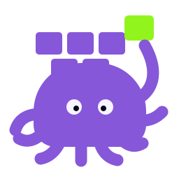

<p align="center">
  
</p>

<h1 align="center">Stop two agents from doing the same work.</h1>

<p align="center"><strong>One shared lease tells one agent “go” and everyone else “wait” before side effects.</strong></p>

OctoStore is a small coordination referee over HTTP. Use an account-free hosted election to choose one coordinator, or an authenticated task lock on a hosted or self-hosted authority to give one exact item a temporary owner.

It does not assign work, execute prompts, run tools, merge branches, or manage a queue. A lease is advisory authority with an expiry—not exactly-once execution. Your agent host must stop or fence work when authority is lost or uncertain.

> Alpha software. APIs may change before 1.0.

## Give your agent the skill

Install the pinned `octostore` skill. This first step requires Git plus Node.js and npm; the fresh-machine commands below install them before the CLI prerequisites when they are not already present:

```bash
git clone --branch v0.14.4 --depth 1 https://github.com/octostore/octostore.io
cd octostore.io
npm ci --ignore-scripts --no-audit --no-fund
./node_modules/.bin/skills add \
  https://github.com/octostore/octostore.io/tree/v0.14.4 \
  --skill octostore --agent codex -y
```

Or inspect the immutable [v0.14.4 agent-skill release artifact](https://github.com/octostore/octostore.io/releases/download/v0.14.4/octostore-agent-skill.md). It teaches primitive selection, shared bootstrap, the lease loop, supervisor coupling, machine events, exit codes, and the stop-on-loss rule. The hosted [current skill](https://octostore.io/agents/SKILL.md) follows the site and may change between releases.

## Install a pinned CLI

Ask before installing software. On a fresh machine, get approval for the applicable package-manager command below, run its clock check, and only then download or execute the installer. The installer verifies the release checksum and reported binary version before the first coordination command.

### Fresh-machine prerequisites

The supervised two-agent path needs `curl`, `jq`, a SHA-256 command, Perl with `Time::HiRes` and its OS clock, Bash, and `seq`. Run one of these commands before the installer; they also make the documented agent-first demo runnable.

Debian / Ubuntu (the `coreutils` package supplies `sha256sum` and `seq`):

```bash
sudo apt-get update
sudo apt-get install -y git nodejs npm curl jq ca-certificates perl bash coreutils
command -v git node npm sh curl jq sha256sum perl bash seq
perl -MTime::HiRes=clock_gettime,CLOCK_BOOTTIME \
  -e 'exit(clock_gettime(CLOCK_BOOTTIME) > 0 ? 0 : 1)'
```

Alpine (the `coreutils` package supplies `sha256sum` and `seq`):

```bash
sudo apk add --no-cache git nodejs npm curl jq ca-certificates perl bash coreutils
command -v git node npm sh curl jq sha256sum perl bash seq
perl -MTime::HiRes=clock_gettime,CLOCK_BOOTTIME \
  -e 'exit(clock_gettime(CLOCK_BOOTTIME) > 0 ? 0 : 1)'
```

macOS with Homebrew (`shasum` is supplied by macOS; Homebrew `coreutils` supplies `gseq`):

```bash
brew install git node curl jq coreutils perl bash
mkdir -p "$HOME/.local/bin"
ln -sf "$(brew --prefix coreutils)/bin/gseq" "$HOME/.local/bin/seq"
export PATH="$HOME/.local/bin:$(brew --prefix curl)/bin:$(brew --prefix jq)/bin:$(brew --prefix perl)/bin:$(brew --prefix bash)/bin:$PATH"
command -v git node npm sh curl jq shasum perl bash seq
perl -MTime::HiRes=clock_gettime,CLOCK_MONOTONIC_RAW \
  -e 'exit(clock_gettime(CLOCK_MONOTONIC_RAW) > 0 ? 0 : 1)'
```

The clock command must exit successfully: the reference supervisor refuses to run without `CLOCK_BOOTTIME` on Linux or `CLOCK_MONOTONIC_RAW` on macOS. Persist the macOS `PATH` change in your shell profile if you will open a new terminal before running the demo.

With those prerequisites already present, the install itself stays short:

```bash
VERSION=v0.14.4
curl -fsSLo octostore-install.sh \
  "https://raw.githubusercontent.com/octostore/octostore.io/$VERSION/install.sh"
cat octostore-install.sh
OCTOSTORE_VERSION="$VERSION" sh octostore-install.sh
octostore --version
```

## Coordinate two agents

Run the exact supervised demo with two executable agent workers. A useful first role is repository merge coordinator: both agents can inspect and prepare work, but only the current leader enters the protected merge section.

```bash
OCTOSTORE_ATLAS_WORKER=./run-agent-atlas \
OCTOSTORE_COMET_WORKER=./run-agent-comet \
./scripts/two-agent-supervised-demo.sh
```

The script creates one hosted room, exports that exact room ID to both candidates, starts both reference supervisors concurrently with a 60-second acquisition bound, proves that one waits, cancels the leader, and proves takeover. `scripts/smoke-two-agents.sh` runs this public script verbatim against a fresh local authority and verifies both workers started and stopped.

Under the hood, the shared room and two hold commands are:

```bash
# Create once outside both candidates.
OCTOSTORE_ELECTION=$(octostore election create --json | jq -r .election_id)
export OCTOSTORE_ELECTION
ATLAS_WORKER=./run-agent-atlas
COMET_WORKER=./run-agent-comet

# Start both supervisors; each gates and contains its worker.
octostore-supervisor election "$OCTOSTORE_ELECTION" agent-atlas "$ATLAS_WORKER" -- \
  octostore election hold "$OCTOSTORE_ELECTION" \
    --candidate agent-atlas --ttl 30 \
    --acquire-timeout 60 --json &
ATLAS_SUPERVISOR_PID=$!

# Agent Comet — same election ID
octostore-supervisor election "$OCTOSTORE_ELECTION" agent-comet "$COMET_WORKER" -- \
  octostore election hold "$OCTOSTORE_ELECTION" \
    --candidate agent-comet --ttl 30 \
    --acquire-timeout 60 --json &
COMET_SUPERVISOR_PID=$!

wait "$ATLAS_SUPERVISOR_PID" "$COMET_SUPERVISOR_PID"
```

Exactly one hold process emits `leader`; the other emits `waiting`. The winner keeps its secret capability in process memory, renews before the local safety deadline, and emits `lost` or `uncertain` before exiting if it can no longer prove authority. It never reacquires after post-acquisition loss.

Because `election hold` receives a secret leader capability, it uses HTTPS by default, bypasses ambient proxies for loopback authorities, and refuses cleartext non-loopback HTTP unless `--allow-insecure-http` is explicitly supplied for development.

A hold process cannot stop an unrelated worker. The installer provides `octostore-supervisor`, the tested [reference supervisor](scripts/reference-supervisor.sh). It gates worker start on `leader`/`acquired`, requires `jq` and Perl with `Time::HiRes`, launches a detached lifetime guardian before the hold can gain authority, and subtracts the greater of wall-clock age (`authority_observed_unix_ms`) and same-host suspend-inclusive age (`authority_observed_continuous_ms`) from `authority_remaining_ms`. Terminal lifecycle output is emitted only after protected-group containment. Never relay or persist authority events across hosts or boots.

The portable reference provides cooperative process-group containment, not a security sandbox. Workers and descendants must not daemonize, call `setsid`, create a new process group, or hand work to another service. Use a dedicated container or cgroup for workers that may detach or cannot be trusted to follow that contract.

## Choose one primitive

| Your question | Primitive | Fastest path | Boundary |
| --- | --- | --- | --- |
| Who coordinates this group right now? | Election | `octostore-supervisor … election hold` | Hosted path needs no login; room IDs are not private authentication |
| Who owns this exact item right now? | Lock | `octostore-supervisor … lock hold` | Authenticated hosted or self-hosted authority |

Use a stable lock key derived from durable work identity. For the hosted authority, sign in at [octostore.io/dashboard.html](https://octostore.io/dashboard.html), save the issued bearer credential in an owner-only file, and select the hosted server explicitly:

```bash
chmod 600 /path/to/octostore-token
export OCTOSTORE_URL=https://api.octostore.io
export OCTOSTORE_TOKEN_FILE=/path/to/octostore-token
AGENT_WORKER=./run-agent
octostore-supervisor lock "repo/octostore/issue-1842" - "$AGENT_WORKER" -- \
  octostore lock hold "repo/octostore/issue-1842" \
    --ttl 120 --acquire-timeout 60 --json
```

Lock hold creates a private process session so two agents using the same bearer token still contend as separate owners. Credentials are read from an owner-only file by default and are refused over cleartext non-loopback HTTP unless the caller explicitly opts into an insecure development path. There is no `--token` flag.

## CLI contract

The existing binary remains the server when run without a coordination subcommand:

```text
octostore                  Start the API server
octostore serve            Start the API server explicitly
octostore election create  Create one shared hosted room
octostore election hold    Wait, lead, renew, and stop on loss
octostore election status  Read current public state
octostore election watch   Reconcile after best-effort watch signals
octostore lock hold        Wait, own, renew, and stop on loss
octostore lock status      Read one authenticated lock
octostore lock watch       Reconcile authenticated lock state
```

`--json` hold output is versioned JSONL. Normative events are `waiting`, `leader`, `acquired`, `renewed`, `released`, `lost`, `uncertain`, and `error`. It never prints leader tokens, lease IDs, or bearer credentials.

| Exit | Meaning | Supervisor action |
| ---: | --- | --- |
| `0` | Read succeeded or authority was cleanly released | Accept only after the corresponding event |
| `11` | Timed out before acquisition | Do not perform the work |
| `20` | Authority lost or uncertain | Stop side effects and reconcile |
| `64` | Invalid input or configuration | Fix configuration; do not retry blindly |
| `70` | Unexpected server/client failure | Treat as not owned |
| `130` / `143` | SIGINT / SIGTERM after a bounded release attempt | Inspect `released` versus `uncertain` |

## Run a self-hosted authority

Start one loopback-only self-hosted authority with an owner-only token file and one local SQLite database:

```bash
install -m 600 /dev/null ./octostore.tokens
printf 'ops:%s\n' "$(openssl rand -hex 32)" > ./octostore.tokens

BIND_ADDR='127.0.0.1:3000' \
STATIC_TOKENS_FILE='./octostore.tokens' \
DATABASE_URL='./octostore.db' \
octostore

curl http://localhost:3000/health
```

OctoStore listens on `0.0.0.0:3000` by default; the first-run command overrides that to loopback. Configure TLS, network policy, and durable secret storage before exposing it. The supported topology is one OctoStore process backed by its SQLite database, not a high-availability consensus cluster.

Local HTTP registration is disabled by default. For a temporary enrollment bootstrap, set `LOCAL_REGISTRATION=true` only with an explicit numeric loopback `BIND_ADDR` and no OAuth or static-token source. Usernames are unique case-insensitively across local, static, and OAuth identities; any collision returns `409` and never reissues the existing token. Ambiguous legacy databases fail startup. Disable registration after enrollment.

Self-hosted GitHub OAuth requires an exact public callback at `/auth/github/callback` and an explicit `OAUTH_DASHBOARD_URL`. Both URLs must use HTTPS, except for an explicit loopback host during local development. OctoStore derives the issuing API origin from `GITHUB_REDIRECT_URI`, includes that origin beside the one-time handoff code, admits the configured dashboard origin through CORS, and the dashboard persists that origin with the credential. The exchange, lock list, token rotation, and OAuth-backed admin requests therefore stay on the deployment that issued the code. Non-hosted OAuth fails startup when the dashboard URL is absent or either authority is ambiguous.

## HTTP remains the source of truth

The CLI is a thin lifecycle adapter. Existing HTTP clients remain supported and do not need a CLI, SDK, account, or API key for public elections.

| Surface | Paths | Authentication |
| --- | --- | --- |
| Elections | `/elections`, `/elections/:id/*` | None; leader mutations use the returned term capability |
| Locks | `/locks`, `/locks/:name/*` | Bearer token |
| Sessions | `/sessions`, `/sessions/:id/*` | Bearer token |
| Webhooks | `/webhooks`, `/webhooks/:id` | Bearer token |
| Health and status | `/health`, `/status` | None |
| Metrics and admin | `/metrics`, `/admin/*` | Admin credential |

Use the [read-only API index](https://api.octostore.io/docs), [OpenAPI YAML](https://api.octostore.io/openapi.yaml), or [human guide](https://octostore.io/docs/) for exact request and response shapes.

The API adds stable error codes, server-generated request IDs, retry guidance, and bounded best-effort election/lock watches. Watch events are hints, not a durable log: reconcile current status after connect, reconnect, lag, or ambiguity.

## Safety model

- Acquire before protected side effects.
- Stop claiming ownership after `lost`, `uncertain`, malformed output, or unexpected hold exit.
- Make downstream writes idempotent and pass the monotonic term where the destination can reject stale generations.
- Generated public room IDs are hard to guess, but they are coordination addresses—not access controls.
- Caller metadata is bounded diagnostic context and must never contain secrets.
- Human approval and policy remain with the agent host; winning a lease is not permission for a destructive action.
- OctoStore cannot revoke an already-issued external effect or guarantee that a paused process obeys lease loss.

## Configuration

| Variable | Default | Purpose |
| --- | --- | --- |
| `BIND_ADDR` | `0.0.0.0:3000` | HTTP listen address |
| `DATABASE_URL` | `octostore.db` | SQLite database path |
| `STATIC_TOKENS` / `STATIC_TOKENS_FILE` | unset | Self-hosted bearer credentials |
| `LOCAL_REGISTRATION` | `false` | Explicit loopback-only local enrollment; cannot be combined with OAuth or static credentials |
| `PUBLIC_ELECTIONS` | `true` | Enable account-free elections |
| `MAX_PUBLIC_ELECTIONS` | `10000` | Maximum simultaneous public rooms |
| `PUBLIC_ELECTION_REQUESTS_PER_MINUTE` | `600` | Per-client room/campaign admission budget |
| `PUBLIC_ELECTION_WATCH_STREAMS_GLOBAL` | `1024` | Global election-watch connection bound |
| `PUBLIC_ELECTION_WATCH_STREAMS_PER_CLIENT` | `8` | Per-client election-watch connection bound |
| `PUBLIC_ELECTION_WATCH_MAX_SECONDS` | `900` | Maximum election-watch lifetime |
| `GITHUB_CLIENT_ID` / `GITHUB_CLIENT_SECRET` | unset | Optional GitHub OAuth |
| `GITHUB_REDIRECT_URI` | `http://localhost:3000/auth/github/callback` | Exact public OAuth callback; its origin becomes the issuing API authority |
| `OAUTH_DASHBOARD_URL` | hosted dashboard only for `api.octostore.io`; otherwise required | Exact browser dashboard allowed to exchange this deployment's one-time code |
| `ADMIN_KEY` | unset | Protect metrics and admin endpoints |
| `OCTOSTORE_CA_BUNDLE` | system roots only | Additional PEM CA bundle for CLI HTTPS and webhook delivery |
| `OCTOSTORE_WEBHOOK_ALLOW_PRIVATE_NETWORKS` | `false` | Keep webhook delivery on public network addresses; set `OCTOSTORE_WEBHOOK_ALLOW_PRIVATE_NETWORKS=true` only for an intentionally private self-hosted network |

Set `PUBLIC_ELECTIONS=false` when a private installation should expose only authenticated coordination.
Webhook destinations must use HTTPS and redirects are never followed. By default, OctoStore rejects localhost plus private, link-local, and reserved literal or DNS-resolved addresses on every delivery attempt to prevent server-side requests into the host network.

## Test the complete path

```bash
./scripts/ci-local.sh
./scripts/smoke-two-agents.sh target/debug/octostore
./scripts/smoke-supervisor.sh target/debug/octostore
./scripts/smoke-release-fixture.sh
```

The release fixture builds a release binary, creates a local release/download/checksum fixture, runs `install.sh`, verifies the installed version and help, starts the installed server, proves two-agent failover, and proves supervisor cancellation on uncertainty. Every started process and temporary file is removed afterward.

## Development

```bash
cargo test --locked
cargo build --release --locked --bin octostore
```

The source repository's complete release-equivalent gate is `./scripts/ci-local.sh`. It runs the pinned Actionlint v1.7.12 source through Go in addition to the Rust, shell, OpenAPI, site, browser, packaging, downgrade, installer, and supervisor checks; hosted CI provisions Go 1.26.5 for the same command.

Useful paths:

- `skills/octostore/SKILL.md` canonical installable skill
- `src/cli.rs` lifecycle CLI
- `src/elections.rs` account-free election
- `src/locks.rs` authenticated lock handlers
- `src/store.rs` in-memory coordination plus SQLite durability
- `openapi.yaml` complete HTTP contract
- `site/` public website and guides

## License

MIT
